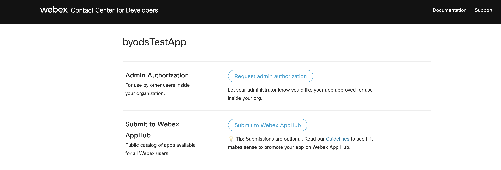
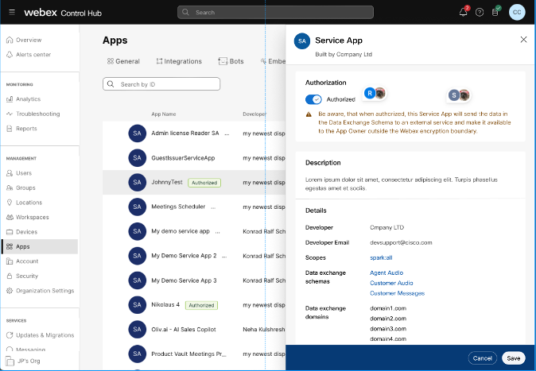
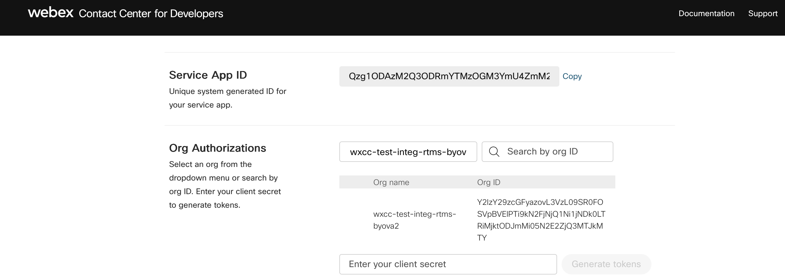
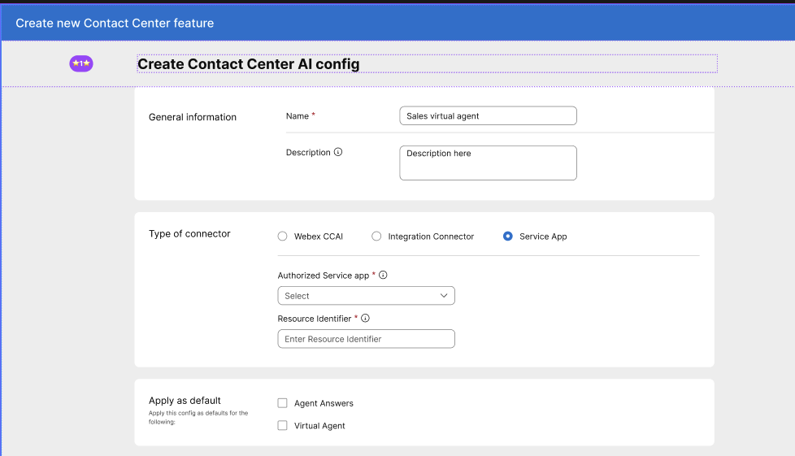
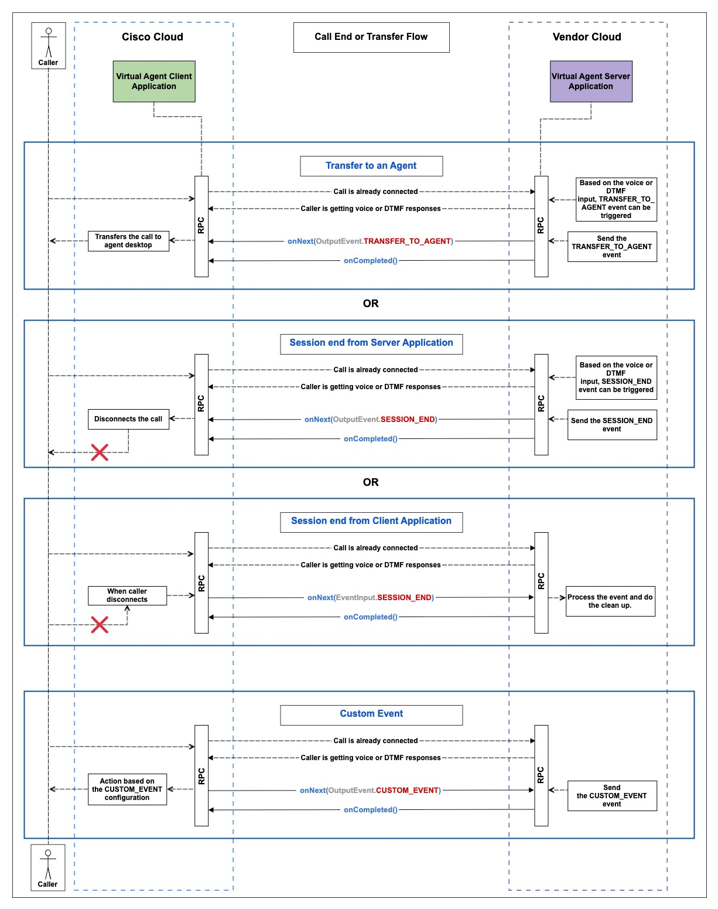

# Table of Contents
1. [Media Service APIs](#media-service-api-section)
   - [Bring your Own Virtual agent](#byova-section)
   - [Media Forking](#media-forking-section)
2. [Key Concepts](#key-concepts-section)
3. [General Guidelines](#general-guidelines-section)
4. [Customer/Partner onboarding](#byova-onboarding-section)
5. [Getting Started with BYoVA](#byova-getting-started-section)
5.2. [Use cases](#communication-section)
6. [Getting Started with Media Forking](#starting-media-forking-section)
7. [mTLS authentication support](#mtls-authentication-support-section)
8. [References](#references-section)

# Webex Contact Center Media service APIs <a name="media-service-api-section"></a>
Provides interface to handle media related use cases for webex contact center platform consumers.
There are different set of APIs for different use cases like Virtual agent, Real time transcripts(transcripts of the ongoing conversation between caller and human agent)
This document captures details of these APIs.
CCAI Platform offer below services as part of media service APIs-
1. BYoVA(Bring your own Virtual)- Where a provider can integrate their Virtual agents within webex contact center platform. Communication between the webex contact center client and Virtual agent happens over gRPC.
2. Real Time Media forking(Human agent - caller interaction)- Where a provider/customer can register a url with us where they want to receive the forked audio of the conversation between the agent(human agent) and caller.


## Bring your Own Virtual Agent(BYoVA) <a name="byova-section"></a>
The Bring Your Own Virtual Agent Initiative empowers Developers and AI vendors to seamlessly integrate external conversational interface(s) (like BOTs), with Webex Contact Center IVR.

### What is a Voice Virtual Agent?

To summarize, the voice virtual agent connects to a caller on a voice call and performs the following actions:
   - Transcribes the caller's **speech to text** for AI processing.
   - Utilizes **Natural Language Understanding** to identify the caller's intent.
   - Maps the identified **intent** to an existing workflow (OR) uses **Generative AI** to create a text response.
   - Converts the generated **text to speech** which is then prompted to the caller back.
   - For escalated calls, provides the human agent with context by supplying the virtual agent's transcript or a summary.
   - Post-call data, including Total Call Handled Time, Call Resolution, Caller Intent, etc. is available in Webex Analyzer.


*Fig 1: A sample virtual agent call that is escalated to a human agent*

**Communication Protocol** - gRPC
**Proto definition** - voiceVirtualagent.proto(path- dialogue-connector-simulator/src/main/proto/com/cisco/wcc/ccai/media/v1)
Further details related to APIs, use cases and usage is defined in separate readme file located [Here](https://github.com/CiscoDevNet/webex-contact-center-provider-sample-code/tree/main/media-service-api/dialog-connector-simulator)

## Real Time Media Forking <a name="media-forking-section"></a>
Media forking can leveraged by customers/partners to fork the audio of human agent-caller interaction to external url(registered with cisco).
Communication Protocol - gRPC
Proto defintion - conversationAudioForking.proto(path- dialogue-connector-simulator/src/main/proto/com/cisco/wcc/ccai/media/v1)
Further details related to APIs, use cases and usage is defined in separate readme file located at [Here](https://github.com/CiscoDevNet/webex-contact-center-provider-sample-code/tree/main/media-service-api/dialog-connector-simulator)

# Key Concepts Used <a name="key-concepts-section"></a>
## Data source
Data source is the communication endpoint between webex contact center and Virtual agent application/media forking server(running on vedor's cloud).
## Bring Your Own Data Source(BYoDS)
To register the communication endpoint or **Data Source** with Webex , Partners/Customers need to make use of BYoDS framework and set of APIs provided by this framework.
More details about this framework and APIs are documented [here](https://developer.webex.com/webex-contact-center/docs/api/v1/data-sources/register-a-data-source).
## Service apps
BYoVA uses service apps as integration framework, to register the communication endpoint(url)/Data Source with webex.
Service apps enable you to request admin permission to use Webex Contact Center REST APIs(BYoDS APIs in this case), reducing dependence on a single user's authorization and mitigating any associated risks to your app.
To know more about service apps, please refer [deveoper-portal](https://developer.webex.com/admin/docs/service-apps).
## Config and flow
Config works as an integration on webex contact center platform where partners/customers configure their integrations with us. In case of of BYoVA, the config will be linked to service app and point to the data source registered for communication.
Flow is the business/activity flow created by admin or flow designer via [control hub](https://admin.webex.com/wxcc/customer-experience/routing-flows/flows)

# General guidelines <a name="general-guidelines-section"></a>
## Supported Audio Configurations
- **Audio Format Supported**: _**wav**_
- **Audio Sampling Rate**: _**16kHz/8KHz**_
- **Language**: _**en-US**_
- **Encoding Format**: _**Linear16/mulaw**_
- Please note, we only support wav or raw audio files, 8/16kHz bit rate, single channel

## gRPC Bi-directional Streaming Guidelines
1. _onNext_, _onError_, and _onCompleted_ are gRPC methods defined in the [StreamObserver<T>](https://grpc.github.io/grpc-java/javadoc/io/grpc/stub/StreamObserver.html) interface for the Java language. The names of these methods and their API signatures vary due to language-specific idioms and implementations of the gRPC library. For more details, please refer to the [gRPC documentation](https://grpc.io/docs/languages/). 
2. For each RPC, _onCompleted_ will be called from the VA Client side after all the data has been sent, and the RPC will be deemed half-closed. Once the VA Server has finished sending all the responses for the same RPC, _onCompleted_ must be called to fully close the RPC. 
3. Each RPC must be closed by calling _onCompleted_ in the end except in cases of unexpected call termination scenarios.

# Customer/Partner onboarding <a name="byova-onboarding-section"></a>
## Creation and authorization of service app
1. To leverage set of use cases provided by Webex contact center as part of media service APIs, customers need to create a service app by going to dev portal.
https://developer.webex.com/admin/docs/service-apps
2. Post the service app creation, the app needs to be submitted for org admin approval.

**3**. Org admin needs to go to Control Hub portal and evaluate the validDomains provided in the service app for the respective use case.
https://admin.webex.com/apps/serviceapps
And approve the app if the provided information is validated.
.

**Note**: Please refer [link](https://developer.webex.com/admin/docs/service-apps) for more details, on service app creation

### Register data source
Data source is nothing but the external url which would be used for the communication between contact center platform and Virtual agent/Media forking server(hosted on external cloud outside cisco boundary).
This url must belong to the validDomains(fqdn) mentioned while service app creation.
1. Once the service app is autorized, go to your service app(my-apps section) and generate token pair for the service app on developer portal by selecting the authorized org from drop down.

This generated token pair includes access token and refresh token.
Refresh token can be used to refresh(valid for 90 days) the access token(which is valid for 14 days). Details of this process, along with API details is documented at [Here](https://developer.webex.com/create/docs/integrations#using-the-refresh-token)
2. Keep these refresh and access token pair safe as this would be required for all data source related operations.
3. Now copy the access token and register the data source either via developer portal or via API.
- To do this via developer portal, use [link](https://developer.webex.com/webex-contact-center/docs/api/v1/data-sources).
- To do this via API, below is the sample code
```
curl --request POST \
     --url https://webexapis.com/v1/dataSources \
     --header 'Accept: application/json' \
     --header 'Authorization: Bearer YOUR_TOKEN' \
     --header 'Content-Type: application/json'
```
Request body-
```
{
  "schemaId": "5397013b-7920-4ffc-807c-e8a3e0a18f43",
  "url": "example.com/url1",
  "audience": "audience",
  "subject": "VA",
  "nonce": "65793b88-ad6e-4ec8-929e-b408038251e3",
  "tokenLifeMinutes": "1440"
}
```
Sample response-
```
{
    "id": "f0a84d12-2760-4610-8c84-719a622f4748", // data source id
    "schemaId": "5397013b-7920-4ffc-807c-e8a3e0a18f43", // VA schema id
    "orgId": "63b02f90-9cc6-43b8-aa6d-cad425ac554c", //org uuid
    "applicationId": "Cf2e954e018f2de8c1403e2618323551df65", //service app id
    "status": "active", // data source is active or not
    "jwsToken": "eyJhbGciOiJIUzI1NiJ9.eyJzdWIiOiJzdWJqZWN0", //signed jwt(signed with cisco's private key)
    "createdBy": "3e4d3b27-1bf1-4916-8d0c-d27fd765fa52", ///created by
    "createdAt": "2024-05-20T15:50:06.754103" // created at
}
```
4. Store the JWS included in the response as this will be sent by contact center client at the time of communication.
**Note** - It is responsibility of the customer to keep refreshing the data source via PUT API. If the data source is expired(post token life time expiry), the communication will stop working.Refer [link](https://developer.webex.com/webex-contact-center/docs/api/v1/data-sources/update-a-data-source) for more details on API.

### Config and flow creation
1. Once the service app is created and authorized, admin needs to go to [integrations/features](https://admin.webex.com/wxcc/integrations/features) section of Control hub and create a new feature/config by selecting the authorized service app.

- Use the “Virtual Agent Activity” in the flow designer to select the virtual agent and configure the routing logic of your workflow.*
- Use "media forking" activity in the flow designer to configure media forking flow.
   
2. Map the EntryPoint to the newly created flow (EntryPoint -> Routing Strategy -> Flow).

## JWS validation while gRPC connection
1. Contact center client/Flow will initiate a gRPC connection with Virtual agent(server), using JWS.
Virtual agent service will validate the jws by fetching public key from cisco and matching the key id.
**Sample code for public key fetching**
```
{
    int responseCode = httpClient.getResponseCode();
        if (responseCode == HttpURLConnection.HTTP_OK) {
            try (InputStream inputStream = httpClient.getInputStream()) {
                byte[] responseBytes = inputStream.readAllBytes();
                String response = new String(responseBytes);
                ObjectMapper objectMapper = new ObjectMapper();
                var publicKeyResponse = objectMapper.readValue(response, PublicKeyResponse.class);//PublicKeyResponse has key
                return publicKeyResponse;
            }
        }
}
```
**Sample code for JWS verification**
```
 private boolean validateJWT(String jwtString, String jwkString) throws JOSEException, ParseException {
        JWK jwk = JWK.parse(jwkString);//public key fetched
        RSAPublicKey publicKey = (RSAPublicKey) jwk.toRSAKey().toPublicKey();
        SignedJWT signedJWT = SignedJWT.parse(jwtString);
        JWSVerifier verifier = new RSASSAVerifier(publicKey);
        boolean verified = signedJWT.verify(verifier);
        if (verified) {
            LOGGER.info("JWT is valid!");
            return true;
        } else {
            LOGGER.info("JWT is invalid!");
            return false;
        }
    }
```
For more detailed detailed implementation of the JWs validation, please refer `src/main/java/com/cisco/wccai/grpc/server/interceptors/JWTAuthorizationHandler.java`


# Getting started with BYoVA <a name="byova-getting-started-section"></a>

## Use cases <a name="communication-section"></a>
The communication between contact center and Virtual agent will happen over gRPC.
Contact center will work as client and Virtual agent application on the vendor's cloud will be the server.
[Schema defintions](https://github.com/webex/dataSourceSchemas/tree/main/Services) of each use case will point to the respective proto defintions(as uri).
Virtual agent application/server needs to implement their logic adhering to these proto defintions.
For example virtual agent proto defintions can be found [here](https://github.com/webex/dataSourceSchemas/tree/main/Services/VoiceVirtualAgent_5397013b-7920-4ffc-807c-e8a3e0a18f43/Proto)

Here,the Dialog Connector represents a sample **gRPC Server Application**(see `src/main/java/com/cisco/wccai/grpc/server/GrpcServer.java`) that listens for incoming requests from the
Webex CC VA Client Application which is a sample **gRPC Client Application**(see `src/main/java/com/cisco/wccai/grpc/client/VoiceVAClient.java`).
To refer sample virtual agent side of code please [refer](./media-service-api/dialog-connector-simulator/src/main/java/com/cisco/wccai/grpc/server/VoiceVAImpl.java)

### Sending audio over gRPC
Once the gRPC connection is established and JWS validation is done, client will send SESSION_START to communicate server about the session.
### Start of Conversation
This use case is explained in this [file](./media-service-api/dialog-connector-simulator/README.md) in the section **Start of conversation**.

**Sample code to send session start from client**
Sample code for client side SESSION_START implementation is included [here](https://github.com/CiscoDevNet/webex-contact-center-provider-sample-code/blob/13875585c92b7b669ce2e02c51f33e3774944a2e/media-service-api/dialog-connector-simulator/src/main/java/com/cisco/wccai/grpc/client/VoiceVAClientImpl.java#L78C23-L78C54)

**Sample code to send audio prompt as response from Virtual agent/Server**
```
{
    Prompt prompt = Prompt.newBuilder()
                .setText(text)
                .setAudioContent(Bytes[])//actual audio bytes
                .setIsBargeInEnabled(barginEnabled)
                .build();
    var requestObserver = audioVirtualAgentBlockingStub.processCallerInput(streamObserver);
    VoiceVAResponse result = VoiceVAResponse.newBuilder()
                .addPrompts(prompt)
                .addOutputEvents(getOutputEvent(ByovaCommon.OutputEvent.EventType.END_OF_INPUT))
                .build();
        return result;
    voiceVAResponse.onNext(result);
    requestObserver.onCompleted();
}
```

### Caller and Virtual agent interaction flow
1. Once the SESSION_START event is sent, server is informed that call is started.
2.. Post this actual flow can be started and any audio, DTMF or call event can be sent.

**Sample code for server to handle audio of caller**
```
{
    //send START_OF_INPUT event
    voiceVAResponse startOfInputResponse = VoiceVAResponse
                .newBuilder()
                .addOutputEvents(ByovaCommon.OutputEvent.newBuilder().setEventType(START_OF_INPUT).build();)
                .build();
    voiceVAResponse.onNext(startOfInputResponse);
    //Client will send caller audio in chunks or as full stream, then on silence detection server should send END_OF_INPUT
    //send END_OF_INPUT
     voiceVAResponse startOfInputResponse = VoiceVAResponse
                .newBuilder()
                .addOutputEvents(ByovaCommon.OutputEvent.newBuilder().setEventType(END_OF_INPUT).build();)
                .build();
    voiceVAResponse.onNext(startOfInputResponse);
    //Client will send onComplete and on receiving onComplete with Prompt or list of Prompts
    Prompt prompt = Prompt.newBuilder()
                .setText(text)
                .setAudioContent(Bytes[])
                .setIsBargeInEnabled(barginEnabled)
                .build();
    var requestObserver = audioVirtualAgentBlockingStub.processCallerInput(streamObserver);
    VoiceVAResponse result = VoiceVAResponse.newBuilder()
                .addPrompts(prompt)
                .addOutputEvents(getOutputEvent(ByovaCommon.OutputEvent.EventType.END_OF_INPUT))
                .addResponseType(FINAL)
                .build();
        return result;
    voiceVAResponse.onNext(result);
    requestObserver.onCompleted();
}
```

### DTMF flow
This use case is explained in this [file](./media-service-api/dialog-connector-simulator/README.md) in the section **DTMF input flow**.

Sample code of client side sending DTMF data is implementated here `https://github.com/CiscoDevNet/webex-contact-center-provider-sample-code/blob/13875585c92b7b669ce2e02c51f33e3774944a2e/media-service-api/dialog-connector-simulator/src/main/java/com/cisco/wccai/grpc/client/VoiceVAClientImpl.java#L51`

```
{
    //Client will send START_OF_DTMF
    requestObserver.onCompleted(); //send onComplete on receiving this

    //Client will send END_OF_DTMF
    requestObserver.onCompleted(); //send onComplete on receiving this
    //Client will send final in the input event and on receiving this, play prompt of required
    Prompt prompt = Prompt.newBuilder()
                .setText(text)
                .setAudioContent(Bytes[])
                .setIsBargeInEnabled(barginEnabled)
                .build();
    var requestObserver = audioVirtualAgentBlockingStub.processCallerInput(streamObserver);
    VoiceVAResponse result = VoiceVAResponse.newBuilder()
                .addPrompts(prompt)
                .addOutputEvents(getOutputEvent(ByovaCommon.OutputEvent.EventType.END_OF_INPUT))
                .addResponseType(FINAL)
                .build();
        return result;
    voiceVAResponse.onNext(result);
    requestObserver.onCompleted();
}

```

### Audio Streaming
This use case is explained in this [file](./media-service-api/dialog-connector-simulator/README.md) in the section **Audio Input Flow**.

#### WAV audio streaming
This use case is explained in this [file](./media-service-api/dialog-connector-simulator/README.md) in the section **Wav Audio Streaming**.

#### Chunk audio streaming
This use case is explained in this [file](./media-service-api/dialog-connector-simulator/README.md) in the section **CHUNK Audio Streaming**.

#### Barge-In Prompts
This use case is explained in this [file](./media-service-api/dialog-connector-simulator/README.md) in the section **Barge-in Prompts**.


### Transfer to agent flow
Transfer to agent: An ongoing call with a virtual agent can be transferred to a live agent by sending the [TRANSFER_TO_AGENT](https://github.com/webex/dataSourceSchemas/blob/f625b9f80dd0673bc0da01f443e31104a1a66dbd/Services/VoiceVirtualAgent_5397013b-7920-4ffc-807c-e8a3e0a18f43/Proto/byova_common.proto#L153) output event, along with an optional audio prompt. 
Note: As per Dialogue connector simulator code dtmf digit "9" is used to initiate agent transfer flow from virtual agent.
Sample code for this is here `https://github.com/CiscoDevNet/webex-contact-center-provider-sample-code/blob/13875585c92b7b669ce2e02c51f33e3774944a2e/media-service-api/dialog-connector-simulator/src/main/java/com/cisco/wccai/grpc/server/VoiceVirtualAgentService.java#L67`
***Sample code for transfer to agent***
```
{
    //on receiving audio or dtmf input to transfer the call to agent, send TRANSFER_TO_AGENT as output event
    requestObserver.onCompleted(); //send onComplete on receiving this

    //Client will send END_OF_DTMF
     //send START_OF_INPUT event
    voiceVAResponse startOfInputResponse = VoiceVAResponse
                .newBuilder()
                .addOutputEvents(ByovaCommon.OutputEvent.newBuilder().setEventType(TRANSFER_TO_AGENT).build();)
                .build();
    requestObserver.onCompleted();
}
```

### Call end flow
1. Session end from server application: Call can be disconnected from the VA Server side by sending the [SESSION_END](https://github.com/webex/dataSourceSchemas/blob/f625b9f80dd0673bc0da01f443e31104a1a66dbd/Services/VoiceVirtualAgent_5397013b-7920-4ffc-807c-e8a3e0a18f43/Proto/byova_common.proto#L152) output event, along with an optional audio prompt. 
2. Session end from client application: When the caller disconnects the call, a [SESSION_END](https://github.com/webex/dataSourceSchemas/blob/f625b9f80dd0673bc0da01f443e31104a1a66dbd/Services/VoiceVirtualAgent_5397013b-7920-4ffc-807c-e8a3e0a18f43/Proto/byova_common.proto#L183) input event will be sent to the VA Server, and no prompt can be sent. 
Note: As per Dialogue connector simulator code dtmf digit "9" is used to initiate agent transfer flow from virtual agent.
Sample code for this is here `https://github.com/CiscoDevNet/webex-contact-center-provider-sample-code/blob/13875585c92b7b669ce2e02c51f33e3774944a2e/media-service-api/dialog-connector-simulator/src/main/java/com/cisco/wccai/grpc/server/VoiceVirtualAgentService.java#L68`
***Sample code for transfer to agent***
```
{
    //on receiving audio or dtmf input to transfer the call to agent, send TRANSFER_TO_AGENT as output event
    requestObserver.onCompleted(); //send onComplete on receiving this

    //Client will send END_OF_DTMF
     //send START_OF_INPUT event
    voiceVAResponse startOfInputResponse = VoiceVAResponse
                .newBuilder()
                .addOutputEvents(ByovaCommon.OutputEvent.newBuilder().setEventType(TRANSFER_TO_AGENT).build();)
                .build();
    requestObserver.onCompleted();
}
```


### Custom event flow
[CUSTOM_EVENT](https://github.com/webex/dataSourceSchemas/blob/f625b9f80dd0673bc0da01f443e31104a1a66dbd/Services/VoiceVirtualAgent_5397013b-7920-4ffc-807c-e8a3e0a18f43/Proto/byova_common.proto#L154) can be sent via flow or Virtual agent application. These custom events can be sent along with INPUT_EVENT(via flow) or OUTPUT_EVENT(via Virtual agent application.)

***Sample code for transfer to agent***
```
{
    ManagedChannel channel;
    channel = NettyChannelBuilder.forAddress("https://example.com/url1", 8080)//initiazing the channel
            .negotiationType(NegotiationType.PLAINTEXT)
            .idleTimeout(5, TimeUnit.SECONDS)
            .build();
    var streamObserver = new VoiceVAStreamObserver();//VoiceVirtualAgentResponse observer generated as per proto file
    VoiceVirtualAgentStub audioVirtualAgentBlockingStub; //VoiceVirtualagent proto stub(generated as per proto and initialized as per channel)
    VoiceVirtualAgentGrpc.VoiceVirtualAgentStub stub = VoiceVirtualAgentGrpc.newStub(channel);//stub initialization
    var requestObserver = audioVirtualAgentBlockingStub.processCallerInput(streamObserver);
    requestObserver.onNext(Voicevirtualagent.VoiceVARequest
                .newBuilder()
                .setEventInput(ByovaCommon.EventInput
                        .newBuilder()
                        .setEventType(ByovaCommon.EventInput.EventType.SESSION_START).build()
                        .setName("custom_param")
                        .setParam("departmentId"."02883"))
                .setConversationId(convoId)
                .build());
    requestObserver.onCompleted();
}
```


# Getting started with Media Forking <a name="starting-media-forking-section"></a>
This feature allows customers to access the media which is the real time interaction between the human agent and the caller in the Webex Contact Center.

Refer to the [Dialog Connector Simulator Sample Code](https://github.com/CiscoDevNet/webex-contact-center-provider-sample-code/tree/main/media-service-api/dialog-connector-simulator).
For the interface definition see `src/main/proto/com/cisco/wcc/ccai/media/v1/conversationaudioforking.proto`.

## Sample code
Here,the Dialog Connector represents a sample **gRPC Server Application**(see `src/main/java/com/cisco/wccai/grpc/server/GrpcServer.java`) that listens for incoming requests from the
To refer sample server side of code please [refer](./media-service-api/dialog-connector-simulator/src/main/java/com/cisco/wccai/grpc/server/ConversationAudioForkImpl.java)

## Serviceability <a name="serviceability-section"></a>
Each Provider endpoint to expose certain APIs to monitor the health of endpoint.
Each Provider endpoint should expose APIs to monitor the health of the endpoint. The APIs should return the status of the service.
Refer to the Check API in the health [proto](./media-service-api/dialog-connector-simulator/src/main/proto/com/cisco/wcc/ccai/v1/health.proto)
https://<Service endpoint>/<service Name>/v1/ping
Response:
```sh
{
"serviceName": "<Service Name>",
"serviceType": "REQUIRED",
"serviceState": "online",
"message": "<Service Name> is ONLINE",
"lastUpdated": "2021-01-22T12:24:37.382Z",
}
```
# mTLS authentication support <a name="mtls-authentication-support-section"></a>
mTLS (Mutual TLS) is an extension of TLS (Transport Layer Security) that ensures both the `Webex CCAI` (client) and `Dialog Connector` (server) authenticate each other during communication. 
Unlike standard TLS, which only authenticates the `Dialog Connector` to the `Webex CCAI`, mTLS requires both parties to present and validate certificates, providing bidirectional authentication.
mTLS is used in this scenario to ensure secure communication and mutual authentication between the `Dialog Connector` and the `Webex CCAI`.

Refer to [wiki](mTLSAuthentication.md) for more details on mTLS authentication support. 

# References <a name="references-section"></a>
1. **Service apps** - https://developer.webex.com/admin/docs/service-apps
2. **Data Sources** - https://developer.webex.com/webex-contact-center/docs/api/v1/data-sources
3. **BYoVA** - https://developer.webex.com/webex-contact-center/docs/bring-your-own-virtual-agent
4. **Schema defintions** - https://github.com/webex/dataSourceSchemas/tree/main/Services
5. **Sample Code** -
The Dialog Connector Simulator is a sample code that demonstrates how to integrate an external conversational interface with Webex Contact Center IVR.
Refer to the [Dialog Connector Simulator Sample Code](./media-service-api/dialog-connector-simulator).
For the interface definition see `src/main/proto/com/cisco/wcc/ccai/media/v1/*`.
