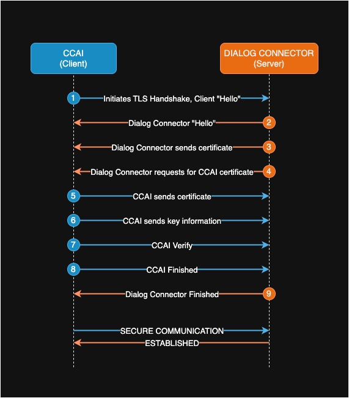

# mTLS (Mutual TLS) authentication
mTLS (Mutual TLS) is an extension of TLS (Transport Layer Security) that ensures both the `Webex CCAI` (client) and `Dialog Connector` (server) authenticate each other during communication. 
Unlike standard TLS, which only authenticates the `Dialog Connector` to the `Webex CCAI`, mTLS requires both parties to present and validate certificates, providing bidirectional authentication. mTLS is used in this scenario to ensure secure communication and mutual authentication between the `Dialog Connector` and the `Webex CCAI`. This is an optional transport-layer security mechanism supported by `Wexcc CCAI` platform. This doesn't eliminate the need for creation of datasource and using JWTs. 

This optional authentication method is currently available for the following features,
- Bring Your Own Virutal Agent
- Media Forking

## mTLS Handshake Process


## Getting started with mTLS

### Keywords
- **Server Certificate**: Publicly issued certificate used by the `Dialog Connector` to verify its identity to the `Webex CCAI`.
- **Server Private Key**: Used by the `Dialog Connector` for encryption.
- **IdenTrust Root CA Certificate**: Used to validate the `Webex CCAI` certificate by `Dialog Connector`. This can be downloaded from [IdenTrust](https://www.identrust.com/identrust-commercial-root-ca-1).
- **Webex CCAI Certificate**: The certificate presented by the `Webex CCAI` during the handshake. This is typically provided by Cisco and is used to verify the identity of the `Webex CCAI`.

### `Webex CCAI` Certificate Details
**Subject**: `CN=insight-orchestrator.intgus1.ciscoccservice.com, O=Cisco Systems Inc., L=San Jose, ST=California, C=US`

**NOTE**: CN (Subject's Common Name) is subjected to change based on the environment, so please check the certificate details for your organization.

## Changes needed in `Dialog Connector Simulator`

`Dialog Connector Simulator` needs to be configured to support mTLS. The following changes are required,

### 1. Changes in gRPC server
Update the `GrpcServer` class to configure SSL for gRPC using Netty. The server will load the root CA certificate from IdenTrust and use its own private key and certificate for mTLS.
**NOTE**: The `Dialog Connector` must explicitly ask for `Webex CCAI` certificate during the TLS handshake. This is done by setting `clientAuth(ClientAuth.REQUIRE)` in the SSL context configuration. 

```java
// Path to the server certificate file
File certFile = new File("../dialog-connector-simulator.crt");
// Path to the server private key file
File keyFile = new File("../dialog-connector-simulator.key");
// Path to the IdenTrust root CA certificate file
File caCert = new File("../identrust-commercial-root-ca.crt"); 
        
// SSL context configuration for the gRPC server
SslContext sslContext = GrpcSslContexts.configure(SslContextBuilder.forServer(certFile, keyFile)) // Load the certificate and private key files
        .trustManager(caCert) // Trust the IdenTrust root CA certificate
        .clientAuth(ClientAuth.REQUIRE) // Needs to be set to REQUIRE to request client certificate
        .build();

// Create the gRPC server builder with SSL context
Server builder = NettyServerBuilder.forPort(PORT) 
        .sslContext(sslContext)  // Set the SSL context for the server
        // Add the required interceptors and services
        .intercept(new ClientCertificateInterceptor()) // Interceptor to handle client certificate validation
        .build()
        .start();
```

### 2. Add an intercept to verify Webex CCAI Certificate
Add the ClientCertificateInterceptor class to extract and validate the client certificate presented during the handshake.

```java
public class ClientCertificateInterceptor implements ServerInterceptor {
    @Override
    public <ReqT, RespT> ServerCall.Listener<ReqT> interceptCall(ServerCall<ReqT, RespT> call,
                                                                 Metadata headers,
                                                                 ServerCallHandler<ReqT, RespT> next) {
        // Extract the SSL session from the call attributes
        SSLSession sslSession = call.getAttributes().get(Grpc.TRANSPORT_ATTR_SSL_SESSION); 
        if (sslSession != null) {
            try {
                // Check if the SSL session has the client certificates
                if (sslSession.getPeerCertificates() == null || sslSession.getPeerCertificates().length == 0) {
                    throw new StatusRuntimeException(Status.UNAUTHENTICATED.withDescription("Client certificate is required"));
                }

                // Retrieve the client certificate from the SSL session
                Certificate certificate = sslSession.getPeerCertificates()[0];

                // Validate the client certificate against the expected Webex CCAI certificate
                validateClientCertificate(clientCert);
            } catch (Exception e) {
                throw new StatusRuntimeException(Status.UNAUTHENTICATED.withDescription("Invalid client certificate: " + e.getMessage()));
            }
        } else {
            throw new StatusRuntimeException(Status.UNAUTHENTICATED.withDescription("SSL session not found"));
        }

        return next.startCall(call, headers);
    }
    
    private void validateClientCertificate(X509Certificate clientCert) {
        // Implement validation logic for the Webex CCAI certificate
        // This can include checking the subject, issuer, and expiration date
    }
}
```
