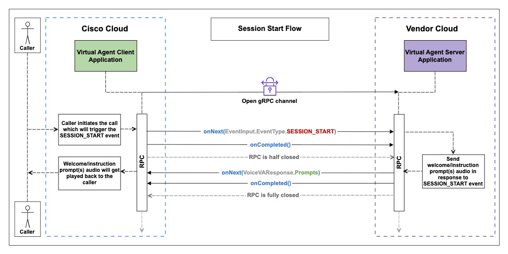
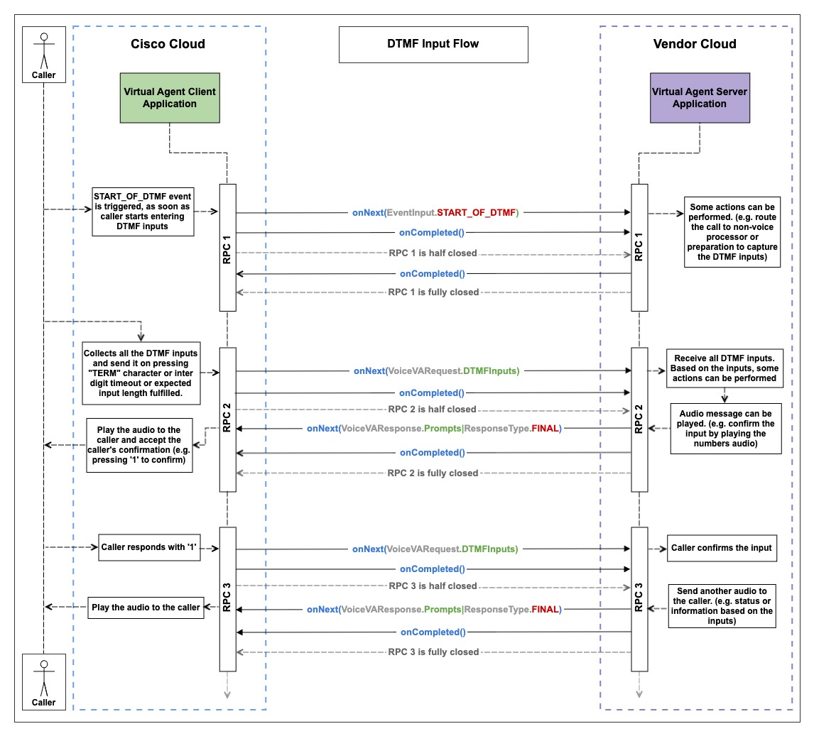
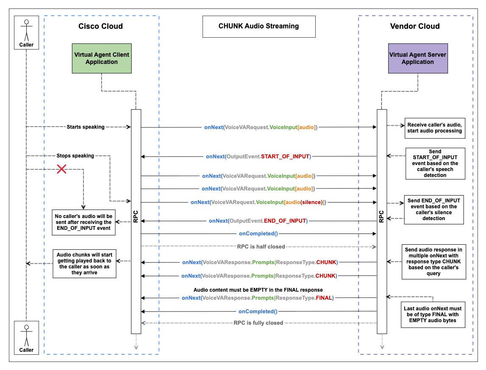
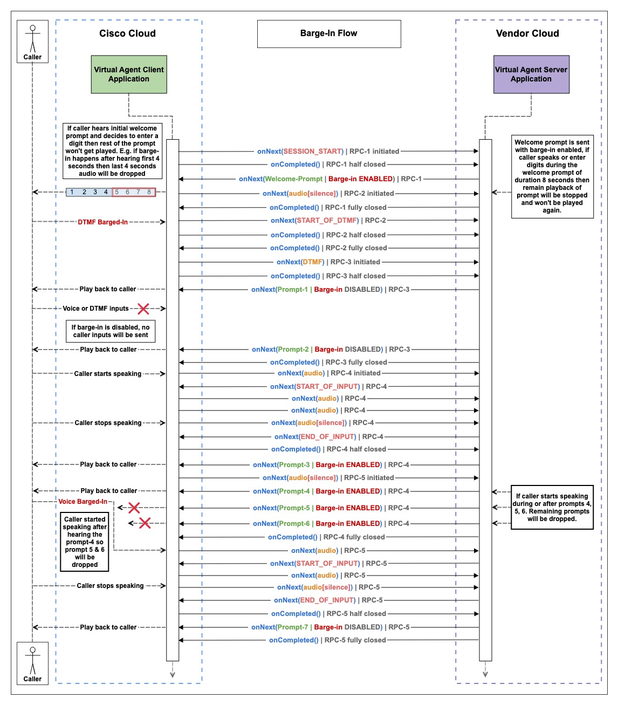

# Table of Contents

1. [Bring your own virtual agent](#byova-section)
2. [Media Forking](#media-forking-section)

# Bring your own Virtual Agent 

The Bring Your Own Virtual Agent Initiative empowers Developers and AI vendors to seamlessly integrate external conversational interface(s) with Webex Contact Center IVR.

## What is a Voice Virtual Agent?

To summarize, the voice virtual agent connects to a caller on a voice call and performs the following actions:
   - Transcribes the caller's **speech to text** for AI processing.
   - Utilizes **Natural Language Understanding** to identify the caller's intent.
   - Maps the identified **intent** to an existing workflow (OR) uses **Generative AI** to create a text response.
   - Converts the generated **text to speech** which is then prompted to the caller back.
   - For escalated calls, provides the human agent with context by supplying the virtual agent's transcript or a summary.
   - Post-call data, including Total Call Handled Time, Call Resolution, Caller Intent, etc. is available in Webex Analyzer.

*Fig 1: A sample virtual agent call that is escalated to a human agent*

## Dialog Connector Simulator
The Dialog Connector Simulator is a sample code that demonstrates how to integrate an external conversational interface with Webex Contact Center IVR.

Refer to the [Dialog Connector Simulator Sample Code](https://github.com/CiscoDevNet/webex-contact-center-ai-sample-code/tree/main/provider-api/dialog-connector-simulator).
For the interface definition see `src/main/proto/com/cisco/wcc/ccai/media/v1/VoiceVirtualAgent.proto`.

### Onboarding Steps for Using the Dialog Connector Simulator

*Fig 2: Architectural Diagram for provisioning a Virtual Agent*

To use the Dialog Connector Simulator, follow these onboarding steps:

After these steps, the Webex Contact Center (WxCC) will orchestrate the call to a specific provider based on the configuration details.

1. **Service App creation and authorization**:-
- Service app with spark-admin:dataSource_read/dataSource_write scopes has to be created using dev-portal

Respective schema(voice virtual agent for BYoVA) has to be selected along with the data exchange domain. In the domain we need to mention the dialogue connector simulator or endpoint at which exchange has to happen.

After app creation, it has to be submitted to customer org admin for authorization-

2. **Org admin authorization and data source registration**:-
   Org admin needs to authorize the apps by going to "apps" section of control hub and validating the fields.
   Provider needs to register the data source using authorized service app's token(which can be generated by going to your service app and generate token for the customer org by selecting the org from drop down on developer portal.

3. **Config creation**:-
   Once the service app is authorized and data source is regsitered, Org admin will then create a config by going to the features section-
   

4. **Flow Creation**:
    - Create a flow with the Virtual Agent Voice Activity and use the above created AI Configuration in the Flow Control UI.
      
      
   *Fig 5: Use the “Virtual Agent Activity” in the flow designer to select the virtual agent and configure the routing logic of your workflow.*
   
5. **EntryPoint Mapping**:
    - Map the EntryPoint to the newly created flow (EntryPoint -> Routing Strategy -> Flow).

### Prerequisites for setup

#### Audio Configuration
- Audio Format Supported: _**wav**_
- Audio Sampling Rate: _**16kHz/8KHz**_
- Language: _**en-US**_
- Encoding Format: _**Linear16/mulaw**_
- Please note, we only support wav or raw audio files, 8/16kHz bit rate, single channel

#### Serviceability
Each Provider endpoint should expose APIs to monitor the health of the endpoint. The APIs should return the status of the service.
Refer to the Check API in the health.proto file.

## Dialog Connector Application Development
### Code Overview
This sample code offers an overview of the various methods and messages used when the Dialog Connector interacts with
the Webex CC VA Client Application.

Here,the Dialog Connector represents a **gRPC Server Application**(see `src/main/java/com/cisco/wccai/grpc/server/GrpcServer.java`) that listens for incoming requests from the
Webex CC VA Client Application which is a **gRPC Client Application**(see `src/main/java/com/cisco/wccai/grpc/client/VoiceVAClient.java`).

### Development Environment Commands
1. Install Java 17.
Verify the Installation by opening a new terminal and run:

    `java -version`
2. Compile Protobuf Definitions: This will generate java classes under target/generated-sources/protobuf/grpc-java and target/generated-sources/protobuf/java.
    
    `cd webex-contact-center-byova-sample-code/provider-api/dialog-connector-simulator`

    `mvn clean compile`
3. Build the Main Application:

   `mvn clean install`

### gRPC Bi-directional Streaming Guidelines
1. _onNext_, _onError_, and _onCompleted_ are gRPC methods defined in the [StreamObserver<T>](https://grpc.github.io/grpc-java/javadoc/io/grpc/stub/StreamObserver.html) interface for the Java language. The names of these methods and their API signatures vary due to language-specific idioms and implementations of the gRPC library. For more details, please refer to the [gRPC documentation](https://grpc.io/docs/languages/). 
2. For each RPC, _onCompleted_ will be called from the VA Client side after all the data has been sent, and the RPC will be deemed half-closed. Once the VA Server has finished sending all the responses for the same RPC, _onCompleted_ must be called to fully close the RPC. 
3. Each RPC must be closed by calling _onCompleted_ in the end except in cases of unexpected call termination scenarios.

### Virtual Agent Streaming and Event Handling Guidelines
1. The sequence of events must follow the same order as outlined in the sequence diagrams. 
2. Welcome prompt should be sent in response to the [SESSION_START](https://github.com/webex/dataSourceSchemas/blob/f625b9f80dd0673bc0da01f443e31104a1a66dbd/Services/VoiceVirtualAgent_5397013b-7920-4ffc-807c-e8a3e0a18f43/Proto/byova_common.proto#L182) event. 
3. At the beginning of the call, the VA Server must choose between WAV Streaming and CHUNK Streaming, this decision should not be altered during the call. For scripted virtual agents where prompts are pre configured VA Server should use WAV streaming and for longer prompts with LLM models, VA Server should use CHUNK streaming. 
   - In the case of WAV Streaming, always send the response as [FINAL](https://github.com/webex/dataSourceSchemas/blob/f625b9f80dd0673bc0da01f443e31104a1a66dbd/Services/VoiceVirtualAgent_5397013b-7920-4ffc-807c-e8a3e0a18f43/Proto/voicevirtualagent.proto#L110) in single onNext with the WAV header in the audio, followed by onCompleted.
   - In the case of CHUNK Streaming, always send a [FINAL](https://github.com/webex/dataSourceSchemas/blob/f625b9f80dd0673bc0da01f443e31104a1a66dbd/Services/VoiceVirtualAgent_5397013b-7920-4ffc-807c-e8a3e0a18f43/Proto/voicevirtualagent.proto#L110) response with EMPTY audio after all the [CHUNK](https://github.com/webex/dataSourceSchemas/blob/f625b9f80dd0673bc0da01f443e31104a1a66dbd/Services/VoiceVirtualAgent_5397013b-7920-4ffc-807c-e8a3e0a18f43/Proto/voicevirtualagent.proto#L112) responses, followed by onCompleted. Minimum [CHUNK](https://github.com/webex/dataSourceSchemas/blob/f625b9f80dd0673bc0da01f443e31104a1a66dbd/Services/VoiceVirtualAgent_5397013b-7920-4ffc-807c-e8a3e0a18f43/Proto/voicevirtualagent.proto#L112) size is 100 bytes, and there is no maximum limit. It is recommended to keep the [CHUNK](https://github.com/webex/dataSourceSchemas/blob/f625b9f80dd0673bc0da01f443e31104a1a66dbd/Services/VoiceVirtualAgent_5397013b-7920-4ffc-807c-e8a3e0a18f43/Proto/voicevirtualagent.proto#L112) size as large as possible.
4. Sending [END_OF_INPUT](https://github.com/webex/dataSourceSchemas/blob/f625b9f80dd0673bc0da01f443e31104a1a66dbd/Services/VoiceVirtualAgent_5397013b-7920-4ffc-807c-e8a3e0a18f43/Proto/byova_common.proto#L162) will immediately stop the caller's audio streaming. So it should be sent upon silence detection from the caller's end. [This is NOT true if [barge-in](https://github.com/webex/dataSourceSchemas/blob/f625b9f80dd0673bc0da01f443e31104a1a66dbd/Services/VoiceVirtualAgent_5397013b-7920-4ffc-807c-e8a3e0a18f43/Proto/voicevirtualagent.proto#L123) is enabled.]
5. If the caller does not provide any input within the configured timeout duration, the [NO_INPUT](https://github.com/webex/dataSourceSchemas/blob/f625b9f80dd0673bc0da01f443e31104a1a66dbd/Services/VoiceVirtualAgent_5397013b-7920-4ffc-807c-e8a3e0a18f43/Proto/byova_common.proto#L185) event will be triggered. 
6. Switching between Voice and DTMF can be achieved by setting the required [INPUT_MODE](https://github.com/webex/dataSourceSchemas/blob/f625b9f80dd0673bc0da01f443e31104a1a66dbd/Services/VoiceVirtualAgent_5397013b-7920-4ffc-807c-e8a3e0a18f43/Proto/voicevirtualagent.proto#L91) in the [VoiceVAResponse](https://github.com/webex/dataSourceSchemas/blob/f625b9f80dd0673bc0da01f443e31104a1a66dbd/Services/VoiceVirtualAgent_5397013b-7920-4ffc-807c-e8a3e0a18f43/Proto/voicevirtualagent.proto#L77). There are three input modes:
   - [INPUT_VOICE](https://github.com/webex/dataSourceSchemas/blob/f625b9f80dd0673bc0da01f443e31104a1a66dbd/Services/VoiceVirtualAgent_5397013b-7920-4ffc-807c-e8a3e0a18f43/Proto/voicevirtualagent.proto#L129) - Only Voice input is accepted
   - [INPUT_EVENT_DTMF](https://github.com/webex/dataSourceSchemas/blob/f625b9f80dd0673bc0da01f443e31104a1a66dbd/Services/VoiceVirtualAgent_5397013b-7920-4ffc-807c-e8a3e0a18f43/Proto/voicevirtualagent.proto#L130) - Only DTMF input is accepted
   - [INPUT_VOICE_DTMF](https://github.com/webex/dataSourceSchemas/blob/f625b9f80dd0673bc0da01f443e31104a1a66dbd/Services/VoiceVirtualAgent_5397013b-7920-4ffc-807c-e8a3e0a18f43/Proto/voicevirtualagent.proto#L131) - Both Voice and DTMF inputs are accepted

### Detailed Flow with Sequence Diagram
### Step 1. Start of Conversation
1. The Dialog Connector will start up as a gRPC Virtual Agent Server Application (**VA Server**).
2. When the caller's call is connected, the VA Client establishes a gRPC connection with the VA Server by creating a new conversation (`conversation_id`) and sending a [VoiceVARequest](https://github.com/webex/dataSourceSchemas/blob/f625b9f80dd0673bc0da01f443e31104a1a66dbd/Services/VoiceVirtualAgent_5397013b-7920-4ffc-807c-e8a3e0a18f43/Proto/voicevirtualagent.proto#L16) to the VA Server with SESSION_START event. The `conversation_id` is used for the entire conversation between the VA Client and VA Server. The request is sent without any audio data.
3. [SESSION_START](https://github.com/webex/dataSourceSchemas/blob/f625b9f80dd0673bc0da01f443e31104a1a66dbd/Services/VoiceVirtualAgent_5397013b-7920-4ffc-807c-e8a3e0a18f43/Proto/byova_common.proto#L182) can be used by the connector to start the session with its AI Service and return a response back to the Client using [ViceVAResponse](https://github.com/webex/dataSourceSchemas/blob/f625b9f80dd0673bc0da01f443e31104a1a66dbd/Services/VoiceVirtualAgent_5397013b-7920-4ffc-807c-e8a3e0a18f43/Proto/voicevirtualagent.proto#L77). It could contain response payloads, prompts, NLU data, and input mode for handling the next interactions from the Caller. Prompts contain the audio which needs to be played to the Caller. It can return one or multiple prompts in a response. Prompts are played one after another at the client side in the sequence of receiving.
4. New RPC is initiated with [SESSION_START](https://github.com/webex/dataSourceSchemas/blob/f625b9f80dd0673bc0da01f443e31104a1a66dbd/Services/VoiceVirtualAgent_5397013b-7920-4ffc-807c-e8a3e0a18f43/Proto/byova_common.proto#L182) event of type [EVENT_INPUT](https://github.com/webex/dataSourceSchemas/blob/f625b9f80dd0673bc0da01f443e31104a1a66dbd/Services/VoiceVirtualAgent_5397013b-7920-4ffc-807c-e8a3e0a18f43/Proto/voicevirtualagent.proto#L41) from VA Client to VA Server.
5. Once prompt is sent, VA Server should call onCompleted. RPC is completed. A new RPC will be initiated to handle further events.

### Step 2. Continue the Conversation Between the Caller and Virtual Agent

### Step 2.1. DTMF Input Flow
1. If caller enters DTMF input by pressing numbers on the phone's keypad then the new RPC-1 gets initiated with [START_OF_DTMF](https://github.com/webex/dataSourceSchemas/blob/f625b9f80dd0673bc0da01f443e31104a1a66dbd/Services/VoiceVirtualAgent_5397013b-7920-4ffc-807c-e8a3e0a18f43/Proto/byova_common.proto#L186) event of type [EVENT_INPUT](https://github.com/webex/dataSourceSchemas/blob/f625b9f80dd0673bc0da01f443e31104a1a66dbd/Services/VoiceVirtualAgent_5397013b-7920-4ffc-807c-e8a3e0a18f43/Proto/voicevirtualagent.proto#L41) from VA Client to VA Server. 
2. [START_OF_DTMF](https://github.com/webex/dataSourceSchemas/blob/f625b9f80dd0673bc0da01f443e31104a1a66dbd/Services/VoiceVirtualAgent_5397013b-7920-4ffc-807c-e8a3e0a18f43/Proto/byova_common.proto#L186) event indicates that the caller is entering DTMF inputs. Based on this event, specific actions can be taken, such as populating required values or updating flags. 
3. In response to [START_OF_DTMF](https://github.com/webex/dataSourceSchemas/blob/f625b9f80dd0673bc0da01f443e31104a1a66dbd/Services/VoiceVirtualAgent_5397013b-7920-4ffc-807c-e8a3e0a18f43/Proto/byova_common.proto#L186) event, onCompleted should be called to complete the RPC-1. 
4. Once the caller has finished entering the DTMF input, it will be sent to VA Server when one of the following conditions is met:
   - [DTMF input length](https://github.com/webex/dataSourceSchemas/blob/f625b9f80dd0673bc0da01f443e31104a1a66dbd/Services/VoiceVirtualAgent_5397013b-7920-4ffc-807c-e8a3e0a18f43/Proto/byova_common.proto#L100) requirement is satisfied, meaning the expected number of digits has been entered.
   - An [inter-digit timeout](https://github.com/webex/dataSourceSchemas/blob/f625b9f80dd0673bc0da01f443e31104a1a66dbd/Services/VoiceVirtualAgent_5397013b-7920-4ffc-807c-e8a3e0a18f43/Proto/byova_common.proto#L98) occurs.
   - [Termination character](https://github.com/webex/dataSourceSchemas/blob/f625b9f80dd0673bc0da01f443e31104a1a66dbd/Services/VoiceVirtualAgent_5397013b-7920-4ffc-807c-e8a3e0a18f43/Proto/byova_common.proto#L99) is pressed.

5. RPC-2 is initiated with the DTMF inputs of type [DTMF_INPUT](https://github.com/webex/dataSourceSchemas/blob/f625b9f80dd0673bc0da01f443e31104a1a66dbd/Services/VoiceVirtualAgent_5397013b-7920-4ffc-807c-e8a3e0a18f43/Proto/voicevirtualagent.proto#L38). 
6. Received DTMF inputs or digits can be process according to the use case. For example, an audio prompt can be sent to confirm the DTMF entries by pressing '1' in onNext followed by onCompleted. RPC-2 is completed. 
7. Caller confirms the previously entered DTMF inputs by pressing '1', RPC-3 is initiated with caller's confirmation DTMF input. 
8. Another prompt can be sent in response to caller's confirmation. For example, an audio prompt with status or information based on the DTMF inputs in onNext followed by onCompleted. RPC-3 is completed.

### Step 2.2. WAV Audio Streaming
1. If caller starts speaking, a new RPC is initiated with caller's audio from VA Client to VA Server. 
2. VA Server should be capable of detecting both the caller's speech and silence. 
3. Once the caller's speech is detected, send the [START_OF_INPUT](https://github.com/webex/dataSourceSchemas/blob/f625b9f80dd0673bc0da01f443e31104a1a66dbd/Services/VoiceVirtualAgent_5397013b-7920-4ffc-807c-e8a3e0a18f43/Proto/byova_common.proto#L160) event in the onNext. 
4. Continue to consume the audio from the caller until silence is detected. 
5. Once silence is detected, send the [END_OF_INPUT](https://github.com/webex/dataSourceSchemas/blob/f625b9f80dd0673bc0da01f443e31104a1a66dbd/Services/VoiceVirtualAgent_5397013b-7920-4ffc-807c-e8a3e0a18f43/Proto/byova_common.proto#L162) event. [Please note that sending the [END_OF_INPUT](https://github.com/webex/dataSourceSchemas/blob/f625b9f80dd0673bc0da01f443e31104a1a66dbd/Services/VoiceVirtualAgent_5397013b-7920-4ffc-807c-e8a3e0a18f43/Proto/byova_common.proto#L162) will immediately stop streaming the caller's audio to the VA Server.]
6. VA Server must wait for the response generation to complete so that all responses can be sent in onNext. [Audio must have a WAV header for each onNext.]
7. Send all responses in one or as a list of prompts with the response type [FINAL](https://github.com/webex/dataSourceSchemas/blob/f625b9f80dd0673bc0da01f443e31104a1a66dbd/Services/VoiceVirtualAgent_5397013b-7920-4ffc-807c-e8a3e0a18f43/Proto/voicevirtualagent.proto#L110) in a single onNext, followed by onCompleted. RPC is completed. [More than one onNext is not permitted to send the responses with the response type [FINAL](https://github.com/webex/dataSourceSchemas/blob/f625b9f80dd0673bc0da01f443e31104a1a66dbd/Services/VoiceVirtualAgent_5397013b-7920-4ffc-807c-e8a3e0a18f43/Proto/voicevirtualagent.proto#L110).]

### Step 2.3. CHUNK Audio Streaming
1. If caller starts speaking, a new RPC is initiated with caller's audio from VA Client to VA Server. 
2. VA Server should be capable of detecting both the caller's speech and silence. 
3. Once the caller's speech is detected, send the [START_OF_INPUT](https://github.com/webex/dataSourceSchemas/blob/f625b9f80dd0673bc0da01f443e31104a1a66dbd/Services/VoiceVirtualAgent_5397013b-7920-4ffc-807c-e8a3e0a18f43/Proto/byova_common.proto#L160) event in the onNext. 
4. Continue to consume the audio from the caller until silence is detected. 
5. Once silence is detected, send the [END_OF_INPUT](https://github.com/webex/dataSourceSchemas/blob/f625b9f80dd0673bc0da01f443e31104a1a66dbd/Services/VoiceVirtualAgent_5397013b-7920-4ffc-807c-e8a3e0a18f43/Proto/byova_common.proto#L162) event. [Please note that sending the [END_OF_INPUT](https://github.com/webex/dataSourceSchemas/blob/f625b9f80dd0673bc0da01f443e31104a1a66dbd/Services/VoiceVirtualAgent_5397013b-7920-4ffc-807c-e8a3e0a18f43/Proto/byova_common.proto#L162) will immediately stop streaming the caller's audio to the VA Server.]
6. VA Server does not need to wait for the response generation to finish. Audio responses can be sent in multiple onNext calls with the response type [CHUNK](https://github.com/webex/dataSourceSchemas/blob/f625b9f80dd0673bc0da01f443e31104a1a66dbd/Services/VoiceVirtualAgent_5397013b-7920-4ffc-807c-e8a3e0a18f43/Proto/voicevirtualagent.proto#L112), without WAV headers, as soon as they are ready. 
7. Last onNext must have EMPTY audio/bytes and response type must be [FINAL](https://github.com/webex/dataSourceSchemas/blob/f625b9f80dd0673bc0da01f443e31104a1a66dbd/Services/VoiceVirtualAgent_5397013b-7920-4ffc-807c-e8a3e0a18f43/Proto/voicevirtualagent.proto#L110). 
8. Send the onCompleted after [FINAL](https://github.com/webex/dataSourceSchemas/blob/f625b9f80dd0673bc0da01f443e31104a1a66dbd/Services/VoiceVirtualAgent_5397013b-7920-4ffc-807c-e8a3e0a18f43/Proto/voicevirtualagent.proto#L110) onNext, RPC is completed.

### Step 3. Barge-In Prompts
Every prompt will have an config option to set [barge-in](https://github.com/webex/dataSourceSchemas/blob/f625b9f80dd0673bc0da01f443e31104a1a66dbd/Services/VoiceVirtualAgent_5397013b-7920-4ffc-807c-e8a3e0a18f43/Proto/voicevirtualagent.proto#L123) to TRUE or FALSE. If barge-in is enabled, any prompt with any [ResponseType (CHUNK, FINAL, PARTIAL)](https://github.com/webex/dataSourceSchemas/blob/f625b9f80dd0673bc0da01f443e31104a1a66dbd/Services/VoiceVirtualAgent_5397013b-7920-4ffc-807c-e8a3e0a18f43/Proto/voicevirtualagent.proto#L109) or [VoiceVAInputMode](https://github.com/webex/dataSourceSchemas/blob/f625b9f80dd0673bc0da01f443e31104a1a66dbd/Services/VoiceVirtualAgent_5397013b-7920-4ffc-807c-e8a3e0a18f43/Proto/voicevirtualagent.proto#L127) will be barged-in on caller's input except termination or transfer event prompts. The following sequence diagram uses the [INPUT_VOICE_DTMF](https://github.com/webex/dataSourceSchemas/blob/f625b9f80dd0673bc0da01f443e31104a1a66dbd/Services/VoiceVirtualAgent_5397013b-7920-4ffc-807c-e8a3e0a18f43/Proto/voicevirtualagent.proto#L131) input mode that means every new RPC will contain silent audio packets until caller speaks and the same applies to [INPUT_VOICE](https://github.com/webex/dataSourceSchemas/blob/f625b9f80dd0673bc0da01f443e31104a1a66dbd/Services/VoiceVirtualAgent_5397013b-7920-4ffc-807c-e8a3e0a18f43/Proto/voicevirtualagent.proto#L129) as well. If the input mode is [INPUT_EVENT_DTMF](https://github.com/webex/dataSourceSchemas/blob/f625b9f80dd0673bc0da01f443e31104a1a66dbd/Services/VoiceVirtualAgent_5397013b-7920-4ffc-807c-e8a3e0a18f43/Proto/voicevirtualagent.proto#L130), a new RPC will be triggered upon DTMF input submission from the caller's end.

1. After [SESSION_START](https://github.com/webex/dataSourceSchemas/blob/f625b9f80dd0673bc0da01f443e31104a1a66dbd/Services/VoiceVirtualAgent_5397013b-7920-4ffc-807c-e8a3e0a18f43/Proto/byova_common.proto#L182), RPC-1 gets half-closed, which means the VA Client cannot send anything in RPC-1. Since [barge-in](https://github.com/webex/dataSourceSchemas/blob/f625b9f80dd0673bc0da01f443e31104a1a66dbd/Services/VoiceVirtualAgent_5397013b-7920-4ffc-807c-e8a3e0a18f43/Proto/voicevirtualagent.proto#L123) is enabled, RPC-2 is initiated. 
2. VA Server sends a Welcome-Prompt of duration 8 seconds with [barge-in](https://github.com/webex/dataSourceSchemas/blob/f625b9f80dd0673bc0da01f443e31104a1a66dbd/Services/VoiceVirtualAgent_5397013b-7920-4ffc-807c-e8a3e0a18f43/Proto/voicevirtualagent.proto#L123) enabled, followed by onCompleted. RPC-1 is completed. 
3. RPC-2 initially has silence audio, but as soon as the caller enters DTMF input after hearing 4 seconds of the prompt, it barges in on the Welcome-Prompt playback in the middle and sends the [START_OF_DTMF](https://github.com/webex/dataSourceSchemas/blob/f625b9f80dd0673bc0da01f443e31104a1a66dbd/Services/VoiceVirtualAgent_5397013b-7920-4ffc-807c-e8a3e0a18f43/Proto/byova_common.proto#L186) event to the VA Server. 
4. VA Server responds to [START_OF_DTMF](https://github.com/webex/dataSourceSchemas/blob/f625b9f80dd0673bc0da01f443e31104a1a66dbd/Services/VoiceVirtualAgent_5397013b-7920-4ffc-807c-e8a3e0a18f43/Proto/byova_common.proto#L186) event with onCompleted. RPC-2 is completed. 
5. RPC-3 is initiated with DTMF inputs, VA Server receives the DTMF inputs and sends Prompt-1 and Prompt-2 with [barge-in](https://github.com/webex/dataSourceSchemas/blob/f625b9f80dd0673bc0da01f443e31104a1a66dbd/Services/VoiceVirtualAgent_5397013b-7920-4ffc-807c-e8a3e0a18f43/Proto/voicevirtualagent.proto#L123) disabled. 
6. Prompt-1 and Prompt-2 cannot be barged in and will be played completely even if the caller tries to speak or provide DTMF input. The caller's input at this point will be dropped. 
7. RPC-3 is completed and RPC-4 is initiated with caller's audio and VA Server detects caller's speech and sends [START_OF_INPUT](https://github.com/webex/dataSourceSchemas/blob/f625b9f80dd0673bc0da01f443e31104a1a66dbd/Services/VoiceVirtualAgent_5397013b-7920-4ffc-807c-e8a3e0a18f43/Proto/byova_common.proto#L160) event. 
8. VA Server collects caller's audio until silence is detected and then sends [END_OF_INPUT](https://github.com/webex/dataSourceSchemas/blob/f625b9f80dd0673bc0da01f443e31104a1a66dbd/Services/VoiceVirtualAgent_5397013b-7920-4ffc-807c-e8a3e0a18f43/Proto/byova_common.proto#L162) event. 
9. VA Server sends 4 prompts with [barge-in](https://github.com/webex/dataSourceSchemas/blob/f625b9f80dd0673bc0da01f443e31104a1a66dbd/Services/VoiceVirtualAgent_5397013b-7920-4ffc-807c-e8a3e0a18f43/Proto/voicevirtualagent.proto#L123) enabled and RPC-5 is initiated. 
10. Prompt-3 and Prompt-4 are played back to the caller, and then the caller barges in, causing Prompt-5 and Prompt-6 to be dropped. 
11. VA Server detects caller's speech and sends [START_OF_INPUT](https://github.com/webex/dataSourceSchemas/blob/f625b9f80dd0673bc0da01f443e31104a1a66dbd/Services/VoiceVirtualAgent_5397013b-7920-4ffc-807c-e8a3e0a18f43/Proto/byova_common.proto#L160) event again and collects audio until the silence is detected. 
12. Upon detecting silence, the VA Server sends an [END_OF_INPUT](https://github.com/webex/dataSourceSchemas/blob/f625b9f80dd0673bc0da01f443e31104a1a66dbd/Services/VoiceVirtualAgent_5397013b-7920-4ffc-807c-e8a3e0a18f43/Proto/byova_common.proto#L162) event, and the last Prompt-7, with [barge-in](https://github.com/webex/dataSourceSchemas/blob/f625b9f80dd0673bc0da01f443e31104a1a66dbd/Services/VoiceVirtualAgent_5397013b-7920-4ffc-807c-e8a3e0a18f43/Proto/voicevirtualagent.proto#L123) disabled, will be played back to the caller.

### Step 4. Call Termination, Transfer, and Custom Event
Call can be terminated, transferred to an agent, or a custom action can be performed, such as sending the caller to another queue.

1. Transfer to agent: An ongoing call with a virtual agent can be transferred to a live agent by sending the [TRANSFER_TO_AGENT](https://github.com/webex/dataSourceSchemas/blob/f625b9f80dd0673bc0da01f443e31104a1a66dbd/Services/VoiceVirtualAgent_5397013b-7920-4ffc-807c-e8a3e0a18f43/Proto/byova_common.proto#L153) output event, along with an optional audio prompt. 
2. Session end from server application: Call can be disconnected from the VA Server side by sending the [SESSION_END](https://github.com/webex/dataSourceSchemas/blob/f625b9f80dd0673bc0da01f443e31104a1a66dbd/Services/VoiceVirtualAgent_5397013b-7920-4ffc-807c-e8a3e0a18f43/Proto/byova_common.proto#L152) output event, along with an optional audio prompt. 
3. Session end from client application: When the caller disconnects the call, a [SESSION_END](https://github.com/webex/dataSourceSchemas/blob/f625b9f80dd0673bc0da01f443e31104a1a66dbd/Services/VoiceVirtualAgent_5397013b-7920-4ffc-807c-e8a3e0a18f43/Proto/byova_common.proto#L183) input event will be sent to the VA Server, and no prompt can be sent. 
4. Custom event: [CUSTOM_EVENT](https://github.com/webex/dataSourceSchemas/blob/f625b9f80dd0673bc0da01f443e31104a1a66dbd/Services/VoiceVirtualAgent_5397013b-7920-4ffc-807c-e8a3e0a18f43/Proto/byova_common.proto#L154) can be sent to perform preconfigured custom actions.

# Media Forking 

This feature allows customers to access the media which is the real time interaction between the human agent and the caller in the Webex Contact Center.

## Dialog Connector Simulator for Media Forking

The Dialog Connector Simulator is a sample code that demonstrates how to receive the media from the Webex Contact Center and do the further processing.

Refer to the [Dialog Connector Simulator Sample Code](https://github.com/CiscoDevNet/webex-contact-center-provider-sample-code/tree/main/media-service-api/dialog-connector-simulator).
For the interface definition see `src/main/proto/com/cisco/wcc/ccai/media/v1/conversationaudioforking.proto`.

The proto has a bidirectional streaming RPC where the client(Webex contact center) streams the audio during the call and server(customer/partner) sends acknowledgement once when onComplete() is received.

### Code Overview

This sample code offers an overview of the various methods and messages used when the when Webex contact center interacts with the dialog connector simulator server.

Here,the dialog connector simulator server represents a **gRPC Server Application**(see `src/main/java/com/cisco/wccai/grpc/server/GrpcServer.java`) that listens for incoming requests from the Webex Contact Center.

### Development Environment Commands
1. Install Java 17.
   Verify the Installation by opening a new terminal and run:

   `java -version`
2. Compile Protobuf Definitions: This will generate java classes under target/generated-sources/protobuf/grpc-java and target/generated-sources/protobuf/java.

   `cd webex-contact-center-provider-sample-code/media-service-api/dialog-connector-simulator`

   `mvn clean compile`
3. Build the Main Application:

   `mvn clean install`
4. The Dialog Connector will start up as a **gRPC Server Application** (`run GrpcServer.java`).

### Detailed Flow with Sequence Diagram

> **_NOTE:_** The customer using this feature would write the logic to do further processing of the media received based on their requirements. The simulator code above does not do any further processing with the audio received. 

